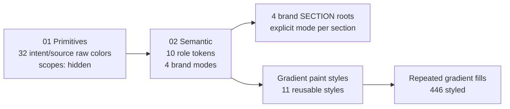

# Plan: Figma variables - Riocity-MCP

## At-a-glance

This file now uses a layered token model:



### Current Status

| Area | Status | Result |
|------|--------|--------|
| `01 Primitives` | Rebuild target updated | 32 raw variables should use intent/source names such as `raw-brand-rio`, `raw-surface-kh-base`, `raw-promo-highlight` |
| `02 Semantic` | Complete | 10 role tokens, 4 modes, all aliases valid |
| RioCity9 frame | Complete | 0 hardcoded opaque solid fills/strokes, 0 stale bindings |
| `theme.css` | RioCity9 first pass | Export currently emits only RioCity9 raw tokens and RioCity9 semantic variables; KH168, CAM88, Leng855 CSS rollout is deferred |
| Gradients | Mostly complete | 11 reusable paint styles, 446 gradient fills styled, 39 hardcoded decorative gradients left |
| Cleanup | Complete | `RioCity9 sections` collection deleted after references were rebound; legacy primitive names are now CSS aliases only for rebuild compatibility |

### Token Flow

| Layer | Purpose | Example | Used By |
|-------|---------|---------|---------|
| Raw primitive | Stores physical values only with intent/source names | `raw-brand-rio = #45ff8b` | Semantic aliases |
| Semantic mode | Gives colors product meaning | `brand-primary`, `text-link` | All four brand sections |
| Paint style | Reuses multi-stop fills | `Gradient / Button / VIP` | Gradient-heavy UI nodes |

### One Frame, Four Modes

| Brand SECTION | Mode Source | What Changes |
|---------------|-------------|--------------|
| `46:740` RioCity9 | `02 Semantic / RioCity9` | brand, surfaces, text, borders |
| `46:4458` Leng855 | `02 Semantic / Leng855` | brand, surfaces, text, borders |
| `46:5245` CAM88 | `02 Semantic / CAM88` | brand, surfaces, text, borders |
| `46:7239` KH168 | `02 Semantic / KH168` | brand, surfaces, text, borders |

Mode switch model:

```text
Frame
  -> explicit mode on 02 Semantic
  -> semantic token resolves to brand-specific primitive
  -> bound UI fills/strokes/text update together
```

CSS export model:

```text
theme.css
  -> RioCity9 only for now
  -> :root contains RioCity9 raw tokens + RioCity9 semantics
  -> [data-theme="rio-city9"] repeats the same semantics for explicit app usage
  -> other themes remain in Figma and export JSON, but are not emitted to CSS yet
```

## File

- **URL / fileKey:** Not stored in this repository. Copy the link from Figma (Share -> Copy link) or read the key from the URL segment after `/design/` - keep it in a password manager or `FIGMA_FILE_KEY` (local env) for MCP / API scripts only.
- **Page:** `0:1` (Page 1)
- **Tool:** Figma MCP `use_figma` - load **figma-use** (and figma-generate-library) skill before each call; sequential calls only; `skillNames: "figma-use,figma-generate-library"`.

## Page structure (four brand roots)

| SECTION `id` | Brand mode (`02 Semantic`) | Source |
|--------------|---------------------------|--------|
| `46:740` | RioCity9 | staging.riocity9 |
| `46:4458` | Leng855 | 855-c.net |
| `46:5245` | CAM88 | 88cam.vip |
| `46:7239` | KH168 | kh168.live |

Each SECTION has `setExplicitVariableModeForCollection` for **`02 Semantic`** (`VariableCollectionId:56:2`) to the matching mode id.

## Collections and Figma rebuild target

### `01 Primitives` rebuild target (single mode `Value`; `scopes = []`)

For the next Figma rebuild, use **intent/source raw names** as the actual primitive variable names. This keeps the raw layer readable without relying on color words like `green`, `blue`, `yellow`, or `red`.

Naming pattern:

```text
raw-{intent-or-source}-{role}
```

Rules:

- Use `raw-*` only for physical hex values.
- Keep primitives hidden from designers where possible: `scopes = []`.
- Do not name raw tokens by visible color. Prefer source/intent: `brand-rio`, `surface-kh-base`, `promo-highlight`, `border-rio`.
- Keep all theme meaning in `02 Semantic`; primitives are still raw fixed values.
- If exporting to CSS, legacy Figma names may remain as compatibility aliases only, not as rebuild names.

Target primitive names:

| Target raw primitive | Value | Legacy/source token |
|----------------------|-------|---------------------|
| `raw-action-leng-peak` | `#ff0000` | `signal/peak` |
| `raw-alert-caution` | `#eab308` | `state/caution` |
| `raw-alert-soft` | `#dd6044` | `state/danger-soft` |
| `raw-border-highlight` | `#8a6b2a` | `accent/trace` |
| `raw-border-kh` | `#252525` | `mono/650` |
| `raw-border-leng` | `#2a1a00` | `signal/700` |
| `raw-border-rio` | `#292929` | `mono/700` |
| `raw-brand-cam` | `#032ea1` | `accord/core` |
| `raw-brand-kh` | `#c8102e` | `brand/strike` |
| `raw-brand-leng` | `#b91c1c` | `signal/600` |
| `raw-brand-rio` | `#45ff8b` | `brand/pulse` |
| `raw-foundation-ink` | `#000000` | `base/ink` |
| `raw-foundation-paper` | `#ffffff` | `base/paper` |
| `raw-link-standard` | `#4a90e2` | `accent/link/500` |
| `raw-partner-mark` | `#012169` | `partner/mark` |
| `raw-prize-highlight` | `#fff500` | `accent/jackpot/500` |
| `raw-promo-highlight` | `#f8d840` | `accent/promo/400` |
| `raw-promo-muted` | `#d4af37` | `state/promo-muted` |
| `raw-promo-strong` | `#f4cf08` | `state/promo` |
| `raw-status-success` | `#10b981` | `state/success` |
| `raw-surface-cam-base` | `#0c162f` | `depth/920` |
| `raw-surface-cam-raised` | `#1a1755` | `depth/840` |
| `raw-surface-kh-base` | `#0f1424` | `depth/900` |
| `raw-surface-kh-raised` | `#1a2138` | `depth/800` |
| `raw-surface-leng-base` | `#3a1515` | `signal/900` |
| `raw-surface-leng-raised` | `#991b1b` | `signal/500` |
| `raw-surface-rio-raised` | `#282828` | `mono/800` |
| `raw-text-muted` | `#6b7280` | `mono/500` |
| `raw-text-subtle` | `#94a3b8` | `tone/subtle` |
| `raw-utility-soft` | `#dbdad8` | `mono/220` |
| `raw-utility-subtle` | `#d8d8d8` | `mono/300` |
| `raw-wash-soft` | `#b0baed` | `wash/400` |

WEB `codeSyntax` pattern: `var(--{raw-name})`, for example `var(--raw-brand-rio)`.

CSS compatibility aliases in `theme.css` may keep the old names:

```css
--brand-pulse: var(--raw-brand-rio);
--depth-900: var(--raw-surface-kh-base);
```

Current CSS export policy:

- `theme.css` is intentionally **RioCity9-only** while this first theme is being tidied.
- Emit only raw variables used by the RioCity9 semantic mode:
  `raw-brand-rio`, `raw-foundation-ink`, `raw-foundation-paper`, `raw-surface-rio-raised`, `raw-border-rio`, `raw-promo-highlight`, `raw-link-standard`, `raw-prize-highlight`.
- Keep only RioCity9 compatibility aliases, such as `brand/pulse` -> `raw-brand-rio`.
- Do not emit KH168, CAM88, or Leng855 raw variables or `[data-theme]` blocks until those themes are cleaned and reviewed.
- `export-done.json` may still contain all four modes because it mirrors Figma. The CSS generator filters it to RioCity9 only.

### `02 Semantic` (modes: RioCity9, KH168, CAM88, Leng855)

Variables: `brand-primary`, `action-cta`, `surface-base`, `surface-container`, `text-primary`, `text-on-emphasis`, `border-default`, `text-promo-highlight`, `text-link`, `text-prize-highlight` - each mode aliases into primitives.

WEB `codeSyntax` (semantic -> app CSS):

| Semantic token | WEB code syntax | Scope |
|----------------|-----------------|-------|
| `brand-primary` | `var(--color-primary)` | `FRAME_FILL`, `SHAPE_FILL` |
| `action-cta` | `var(--color-accent)` | `FRAME_FILL`, `SHAPE_FILL` |
| `surface-base` | `var(--color-surface)` | `FRAME_FILL`, `SHAPE_FILL` |
| `surface-container` | `var(--color-surface-elevated)` | `FRAME_FILL`, `SHAPE_FILL` |
| `text-primary` | `var(--color-text-primary)` | `TEXT_FILL` |
| `text-on-emphasis` | `var(--color-text-on-emphasis)` | `TEXT_FILL` |
| `border-default` | `var(--color-border)` | `STROKE_COLOR` |
| `text-promo-highlight` | `var(--color-text-promo-highlight)` | `TEXT_FILL` |
| `text-link` | `var(--color-text-link)` | `TEXT_FILL` |
| `text-prize-highlight` | `var(--color-text-prize-highlight)` | `TEXT_FILL` |

Semantic mode alias matrix for Figma rebuild:

| Semantic token | RioCity9 | KH168 | CAM88 | Leng855 |
|----------------|----------|-------|-------|---------|
| `brand-primary` | `raw-brand-rio` | `raw-brand-kh` | `raw-brand-cam` | `raw-brand-leng` |
| `action-cta` | `raw-brand-rio` | `raw-brand-kh` | `raw-brand-cam` | `raw-action-leng-peak` |
| `surface-base` | `raw-foundation-ink` | `raw-surface-kh-base` | `raw-surface-cam-base` | `raw-surface-leng-base` |
| `surface-container` | `raw-surface-rio-raised` | `raw-surface-kh-raised` | `raw-surface-cam-raised` | `raw-surface-leng-raised` |
| `text-primary` | `raw-foundation-paper` | `raw-foundation-paper` | `raw-foundation-paper` | `raw-foundation-paper` |
| `text-on-emphasis` | `raw-foundation-ink` | `raw-foundation-paper` | `raw-foundation-paper` | `raw-foundation-paper` |
| `border-default` | `raw-border-rio` | `raw-border-kh` | `raw-surface-cam-base` | `raw-border-leng` |
| `text-promo-highlight` | `raw-promo-highlight` | `raw-promo-strong` | `raw-alert-soft` | `raw-promo-muted` |
| `text-link` | `raw-link-standard` | `raw-brand-kh` | `raw-brand-cam` | `raw-brand-leng` |
| `text-prize-highlight` | `raw-prize-highlight` | `raw-promo-strong` | `raw-alert-caution` | `raw-promo-muted` |

### Retired `RioCity9 sections`

The former `RioCity9 sections` collection (`VariableCollectionId:101:2`) was removed after its three text tokens were promoted into `02 Semantic`:

| Former token | Replacement semantic token |
|--------------|----------------------------|
| `promo-strip/text-highlight` | `text-promo-highlight` |
| `promo-strip/text-link` | `text-link` |
| `recent-big-win/text-game` | `text-prize-highlight` |

## Gradient tokens (semantic naming)

Canonical **Figma paint style names** use grouped Figma style names. The semantic ID in the description keeps the screenshot-style dot notation. **CSS / Dev Mode** uses kebab-case `var(--...)`.

| Figma paint style | Semantic ID | Suggested WEB / CSS token | Applied |
|-------------------|-------------|---------------------------|---------|
| `Gradient / Brand / Primary` | `gradient.brand.primary` | `var(--gradient-brand-primary)` | 7 |
| `Gradient / Brand / Accent` | `gradient.brand.accent` | `var(--gradient-brand-accent)` | 39 |
| `Gradient / Promo / Gold` | `gradient.promo.gold` | `var(--gradient-promo-gold)` | 11 |
| `Gradient / Promo / Red` | `gradient.promo.red` | `var(--gradient-promo-red)` | seed style |
| `Gradient / Surface / Glow` | `gradient.surface.glow` | `var(--gradient-surface-glow)` | 8 |
| `Gradient / Surface / Card` | `gradient.surface.card` | `var(--gradient-surface-card)` | 60 |
| `Gradient / Surface / Icon` | `gradient.surface.icon` | `var(--gradient-surface-icon)` | 195 |
| `Gradient / Surface / Subtle` | `gradient.surface.subtle` | `var(--gradient-surface-subtle)` | 12 |
| `Gradient / Button / VIP` | `gradient.button.vip` | `var(--gradient-button-vip)` | 72 |
| `Gradient / Hero / Primary` | `gradient.hero.primary` | `var(--gradient-hero-primary)` | 34 |
| `Gradient / Border / Highlight` | `gradient.border.highlight` | `var(--gradient-border-highlight)` | 8 |

**Intended roles (non-chromatic where possible):**

- **`gradient.brand.primary`** - hero / nav brand wash (primary brand emphasis over surface).
- **`gradient.brand.accent`** - secondary brand emphasis (e.g. tabs, chips).
- **`gradient.promo.gold`** - promotional panels, VIP / bonus strips (still "promo" + material name in screenshot; treat as named promo lane, not a generic fill).
- **`gradient.promo.red`** - urgency promo / limited-time strips.
- **`gradient.surface.glow` / `gradient.surface.card` / `gradient.surface.icon` / `gradient.surface.subtle`** - card, icon, and subtle UI depth.
- **`gradient.button.vip`** - premium CTA fills (pair with `text-on-emphasis` where contrast allows).
- **`gradient.hero.primary`** - hero/category icon washes.
- **`gradient.border.highlight`** - bordered card/highlight surfaces.

**Figma / Plugin API constraints**

- `figma.variables.setBoundVariableForPaint` accepts **only `SolidPaint`**. Binding the **entire** `GRADIENT` paint to one COLOR variable **throws**; **IMAGE** paints are likewise out of scope for that helper.
- **Gradient stop colors** may expose `boundVariables.color` on each `ColorStop` (see Plugin API `ColorStop`). Prefer binding each stop to **`02 Semantic`** COLOR variables so **`02 Semantic`** mode switches on the board update stops without duplicating six styles × four brands. If a Figma build rejects stop binding from the plugin, fallback: keep fixed hex stops in the paint style and duplicate styles per brand only as a last resort.

**Implementation strategy**

1. **Local `PaintStyle`** - Create (or update) reusable **`PaintStyle`** rows whose **names** are exactly the grouped strings in the table. (Paint styles are **file-scoped**; use the Assets panel or an optional swatch frame on a token page for visual audit - they are not children of a Page node.)
2. **Stops** - Each style: `GRADIENT_LINEAR` (or `GRADIENT_RADIAL` where design requires) with **two stops** minimum; bind stop colors to **`02 Semantic`** tokens (`brand-primary`, `action-cta`, `surface-base`, `surface-container`, etc.) per row above. Use a neutral fallback RGB on each stop if the editor requires a literal color alongside the alias.
3. **Do not** add STRING variables holding raw `linear-gradient(...)` unless the product pipeline explicitly reads CSS strings from Dev Mode; prefer paint styles + semantic COLOR variables.
4. **Migrate** - For nodes with hardcoded `GRADIENT` fills that match an audited pattern, set `node.fillStyleId = <PaintStyle.id>` in small `use_figma` batches; return `mutatedNodeIds`.

**Style description (optional)** - In Figma UI, paste the matching `var(--gradient-...)` into the style description for handoff alignment.

## Binding approach (reference for continuation)

- Prefer **`02 Semantic`** (respects scopes: TEXT vs fill vs stroke).
- Fallback: **nearest primitive** in `01 Primitives` within Euclidean distance **~0.11** in RGB 0-1 space.
- **Skip** paints with opacity **&lt; 0.999** (overlays) to avoid visual drift.
- **IMAGE**: not converted with variable bind APIs above.
- **GRADIENT**: do **not** use the opaque SOLID nearest-color bind path; use **`PaintStyle`** + **`ColorStop` -> `02 Semantic`** (see **Gradient tokens**). Whole-paint variable bind is not supported for gradient paints via `setBoundVariableForPaint`.
- **Fonts:** `loadFontAsync` before mutating `TEXT`.

## Figma rebuild sequence for raw palette rename

Use this when rebuilding the design system in a fresh or cleaned Figma file.

1. Create `01 Primitives` with one mode: `Value`.
2. Create the 32 target `raw-*` variables from the table above as `COLOR` variables.
3. Set each primitive `scopes = []`.
4. Set WEB code syntax to `var(--raw-...)`.
5. Create `02 Semantic` with four modes: `RioCity9`, `KH168`, `CAM88`, `Leng855`.
6. Create the 10 semantic variables and alias every mode to the new `raw-*` variables.
7. Apply explicit `02 Semantic` modes to the four SECTION roots.
8. Bind UI fills, strokes, and text to `02 Semantic` first. Use raw primitives only for rare fixed values or compatibility audit work.
9. Do not rebuild `RioCity9 sections`; it has been retired.
10. For the current CSS export, emit RioCity9 only. Keep old primitive names only as RioCity9 compatibility aliases if existing app code still references them.

## Completed work (session summary)

1. Discovered existing `01 Primitives` + `02 Semantic` (4 brand modes); reused instead of duplicating.
2. Set per-SECTION explicit modes for `02 Semantic` on all four html.to.design roots.
3. Multi-pass bind: semantics + primitives; added primitives (`yellow`, `gold`, `navy-brand`, `slate`, `muted-gold`, `coral`, `emerald`, `gray`, `wash`, `mono/*`, `accent/trace`) then consolidated naming into non-chromatic **`01 Primitives`** names.
4. Documented the next rebuild target: replace legacy primitive names with intent/source `raw-*` names while keeping old CSS aliases only for compatibility.
5. **Section text merge:** promoted `promo-strip/text-highlight`, `promo-strip/text-link`, and `recent-big-win/text-game` into `02 Semantic` as `text-promo-highlight`, `text-link`, and `text-prize-highlight`; rebound existing RioCity text usages and deleted the old `RioCity9 sections` collection.
6. **Gradient paint styles:** 11 local reusable **`PaintStyle`** entries under `Gradient / Brand`, `Gradient / Surface`, `Gradient / Promo`, `Gradient / Button`, `Gradient / Hero`, and `Gradient / Border`; 446 repeated gradient fills styled. 39 hardcoded gradients remain because they are decorative, logo-like, or one-off.
7. **RioCity9 cleanup:** RioCity9 section (`46:740`) has **0 hardcoded opaque solid fills/strokes**, **0 stale variable bindings**, and all colors rebound to the current scalable variables.
8. **RioCity9 CSS cleanup:** `theme.css` now emits only RioCity9 raw variables, RioCity9 semantic variables, and RioCity9 compatibility aliases. Other theme CSS blocks are intentionally deferred.

**Last reported opaque stats:** RioCity9 is fully variable-bound for opaque solid fills/strokes. Other brand boards still have optional stroke-heavy and section-token cleanup work.

## Continuation (when you resume)

1. **Strokes:** Add stroke-scoped primitives or semantic `border-*` variants; rerun bind for `STROKE_COLOR` only.
2. **Semantics rename:** If you want Figma names to match `color/primary`, rename `02 Semantic` variables and refresh WEB `codeSyntax` (bindings follow variable id).
3. **Future CSS theme rollout:** After RioCity9 is reviewed, expand `generate-theme-css.mjs` to emit KH168, CAM88, and Leng855 raw subsets and `[data-theme]` blocks one theme at a time.
4. **Gradients:** 11 `gradient.*` **PaintStyle** entries exist with stops bound to **`02 Semantic`**. Remaining work: phased **`fillStyleId`** migration for matching hardcoded `GRADIENT` layers (see **Gradient tokens**).

## Risks / notes

- Moving nodes **outside** their brand `SECTION` without updating explicit modes can change resolved colors.
- Figma **plan mode limits** may cap modes per collection (already using 4 modes on `02 Semantic`).
- `use_figma` scripts must stay small; return structured JSON; never parallel `use_figma`.

## Related plan file (Cursor)

An earlier iteration of this plan also exists at:

`c:\Users\Vincent\.cursor\plans\figma_color_variables_3990b7f4.plan.md`

This **`plan.md`** in the repo is the **canonical handoff** for continuing later.
