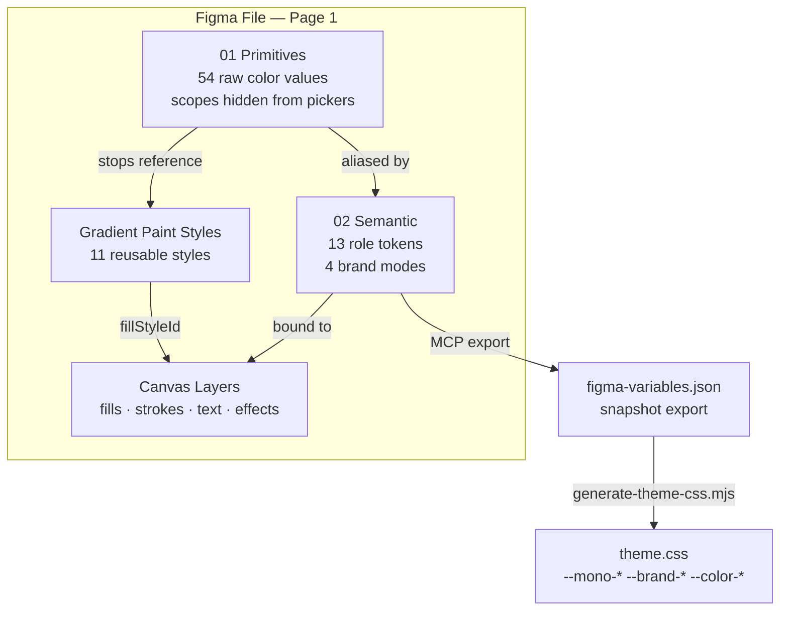
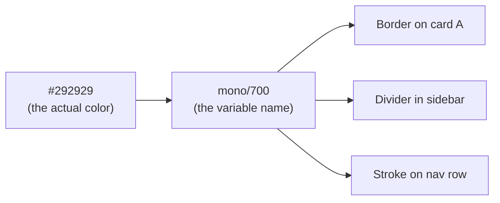
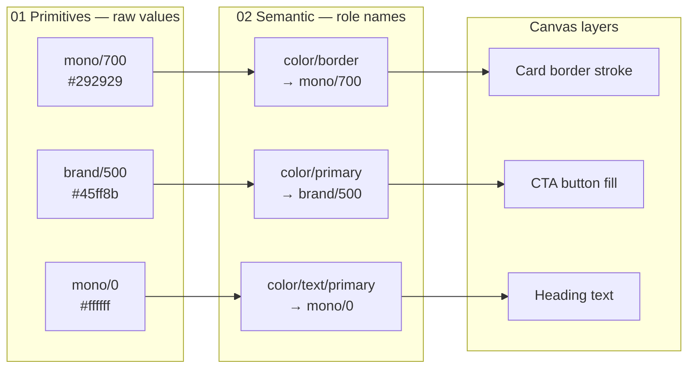
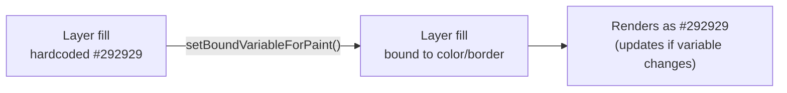
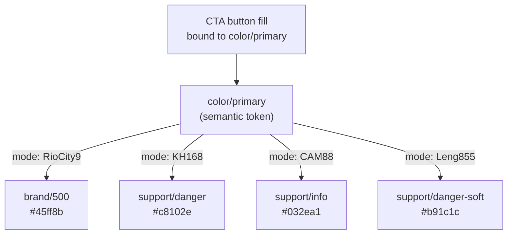
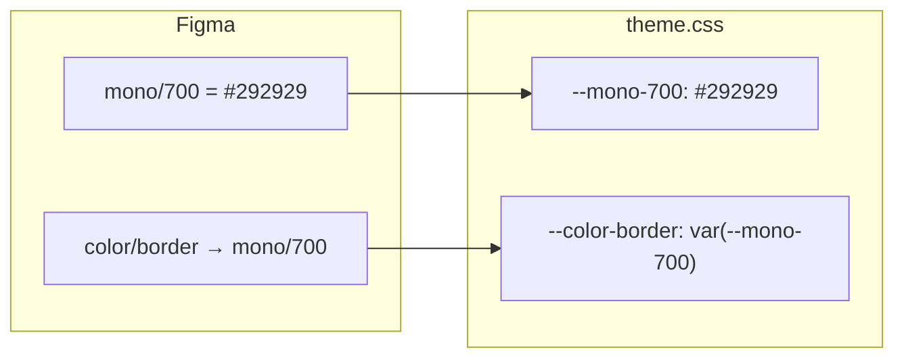
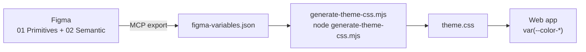
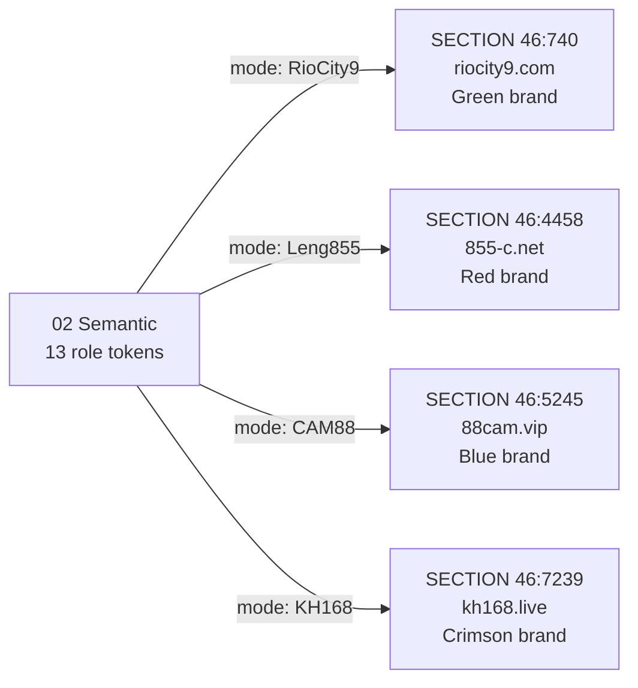

# Plan: Figma variables — Riocity-MCP

## What this file is

The Riocity-MCP Figma file contains four brand websites captured as static html.to.design frames on a single page — RioCity9, Leng855, CAM88, and KH168. A two-layer color variable system (primitives + semantics) is applied across all four brands so one token change updates every matching layer instantly, and the same token names export cleanly to CSS for web development.

---

## Overall architecture


```mermaid
flowchart TD
  subgraph figma ["Figma File — Page 1"]
    P["01 Primitives\n54 raw color values\nscopes hidden from pickers"]
    S["02 Semantic\n13 role tokens\n4 brand modes"]
    G["Gradient Paint Styles\n11 reusable styles"]
    F["Canvas Layers\nfills · strokes · text · effects"]
    P -->|"aliased by"| S
    S -->|"bound to"| F
    P -->|"stops reference"| G
    G -->|"fillStyleId"| F
  end
  FV["figma-variables.json\nsnapshot export"]
  CSS["theme.css\n--mono-* --brand-* --color-*"]
  S -->|"MCP export"| FV
  FV -->|"generate-theme-css.mjs"| CSS
```

---

## How color variables are applied in Figma

This section explains the concept from first principles. Read this before touching variables in the file.

### What a Figma color variable is

A variable stores a **single color value** under a **name**. Instead of painting a layer the raw hex `#292929`, you paint it with the variable `mono/700` which resolves to `#292929`. When the variable value changes, every layer bound to it updates instantly across the whole file — no find-and-replace needed.


```mermaid
flowchart LR
  hex["#292929\n(the actual color)"]
  var["mono/700\n(the variable name)"]
  L1["Border on card A"]
  L2["Divider in sidebar"]
  L3["Stroke on nav row"]
  hex --> var
  var --> L1
  var --> L2
  var --> L3
```

Changing `mono/700` from `#292929` to `#303030` instantly updates all three layers above — without touching any layer directly.

---

### Two-layer system: Primitives then Semantics

This file uses two collections. **Primitives** hold raw values only. **Semantics** assign meaning. Semantic tokens point to primitives — never to a raw hex.


```mermaid
flowchart LR
  subgraph prim ["01 Primitives — raw values"]
    P1["mono/700\n#292929"]
    P2["brand/500\n#45ff8b"]
    P3["mono/0\n#ffffff"]
  end
  subgraph sem ["02 Semantic — role names"]
    S1["color/border\n→ mono/700"]
    S2["color/primary\n→ brand/500"]
    S3["color/text/primary\n→ mono/0"]
  end
  subgraph canvas ["Canvas layers"]
    C1["Card border stroke"]
    C2["CTA button fill"]
    C3["Heading text"]
  end
  P1 --> S1 --> C1
  P2 --> S2 --> C2
  P3 --> S3 --> C3
```

**Rule:** canvas layers are bound to **semantics only**. Primitives are invisible in property pickers (`scopes: []`). This means a designer sees `color/border`, not `mono/700`, and never a raw hex.

---

### How a fill, stroke, or text gets bound

A paint on any layer is either a hardcoded hex or a **variable-bound paint**. Binding replaces the static value with a live reference:


```mermaid
flowchart LR
  Before["Layer fill\nhardcoded #292929"]
  Bound["Layer fill\nbound to color/border"]
  Resolves["Renders as #292929\n(updates if variable changes)"]
  Before -->|"setBoundVariableForPaint()"| Bound
  Bound --> Resolves
```

**What can be bound:**

| Paint type | Can bind? | Notes |
|------------|-----------|-------|
| Solid fill | Yes | Primary binding target |
| Solid stroke | Yes | Use `STROKE_COLOR` scope |
| Effect color | Yes | Drop shadows, inner shadows |
| Gradient stop color | Partial | Via `ColorStop.boundVariables.color` — API support varies |
| IMAGE fill | No | Raster asset, outside variable system |

---

### How brand modes change colors without touching layers

Each brand section (SECTION node) has an **explicit mode** applied to `02 Semantic`. The mode tells every semantic token which primitive to resolve to. The canvas layers are never modified — only the active mode on the section root changes.


```mermaid
flowchart TD
  Layer["CTA button fill\nbound to color/primary"]
  Sem["color/primary\n(semantic token)"]
  Layer --> Sem
  Sem -->|"mode: RioCity9"| Rio["brand/500\n#45ff8b"]
  Sem -->|"mode: KH168"| KH["support/danger\n#c8102e"]
  Sem -->|"mode: CAM88"| CAM["support/info\n#032ea1"]
  Sem -->|"mode: Leng855"| Leng["support/danger-soft\n#b91c1c"]
```

The same CTA button layer shows green on the RioCity9 section and red on KH168 — purely from the section's active mode.

---

### How this maps to CSS

The two-layer system maps directly to CSS custom properties. Figma variable names use slashes; CSS uses hyphens.


```mermaid
flowchart LR
  subgraph figma ["Figma"]
    FP["mono/700 = #292929"]
    FS["color/border → mono/700"]
  end
  subgraph css ["theme.css"]
    CP["--mono-700: #292929"]
    CS["--color-border: var(--mono-700)"]
  end
  FP --> CP
  FS --> CS
```

Usage in code:

```css
.card { border: 1px solid var(--color-border); }
.cta  { background: var(--color-primary); }
.heading { color: var(--color-text-primary); }
```

Updating `mono/700` in Figma and re-exporting `figma-variables.json` updates both the Figma fills and the CSS variable in one step.

---

### CSS export pipeline


```mermaid
flowchart LR
  Figma["Figma\n01 Primitives + 02 Semantic"]
  FV["figma-variables.json"]
  GEN["generate-theme-css.mjs\nnode generate-theme-css.mjs"]
  CSS["theme.css"]
  App["Web app\nvar(--color-*)"]
  Figma -->|"MCP export"| FV
  FV --> GEN --> CSS --> App
```

To refresh CSS after editing variables in Figma:
1. Re-export `figma-variables.json` (or ask the MCP agent to pull from Figma).
2. Run `node generate-theme-css.mjs`.

---

## One file, four brands

Four brand sections live on a single Figma page. Each section has `setExplicitVariableModeForCollection` applied to `02 Semantic` so layers inside that section resolve to brand-specific colors.


```mermaid
flowchart LR
  sem["02 Semantic\n13 role tokens"]
  sem -->|"mode: RioCity9"| rio["SECTION 46:740\nriocity9.com\nGreen brand"]
  sem -->|"mode: Leng855"| len["SECTION 46:4458\n855-c.net\nRed brand"]
  sem -->|"mode: CAM88"| cam["SECTION 46:5245\n88cam.vip\nBlue brand"]
  sem -->|"mode: KH168"| kh["SECTION 46:7239\nkh168.live\nCrimson brand"]
```

| SECTION node | Brand | Source site |
|-------------|-------|-------------|
| `46:740` | RioCity9 | staging.riocity9 |
| `46:4458` | Leng855 | 855-c.net |
| `46:5245` | CAM88 | 88cam.vip |
| `46:7239` | KH168 | kh168.live |

---

## Current status

| Area | Status | Detail |
|------|--------|--------|
| `01 Primitives` | Complete | 54 variables; abstract names (`mono/*`, `brand/*`, `accent/*`, `support/*`, `overlay/*`) |
| `02 Semantic` | Complete | 13 role tokens; single mode `Default` (multi-brand modes are a future step) |
| Solid fills / strokes | Complete | 2,985 fills + 576 strokes bound file-wide |
| `Web_User Dahsboard` | Complete | 864 solids bound, 0 hardcoded |
| Gradients | Partial | 150 unbound gradient stops in dashboard (API limit); 206 file-wide |
| `theme.css` | Current | Generated from `figma-variables.json` via `generate-theme-css.mjs` |
| Multi-brand CSS | Deferred | KH168, CAM88, Leng855 `[data-theme]` blocks pending mode setup |

---

## Token naming guide

### Primitive naming anatomy

```
mono / 700
^^^^   ^^^
group  scale step (0 = lightest, 950 = darkest)

brand / 500
^^^^^   ^^^
group  scale step

support / danger
^^^^^^^   ^^^^^^
group     role descriptor

overlay / default
^^^^^^^   ^^^^^^^
group     variant
```

### Primitive groups

| Group | Purpose | Example |
|-------|---------|---------|
| `mono/*` | Neutral grayscale ramp | `mono/0` (#fff) → `mono/950` (#000) |
| `brand/*` | Primary brand color ramp | `brand/500` (#45ff8b) |
| `accent/*` | Gold / highlight ramp | `accent/400` (#f8d840) |
| `support/*` | Status and utility colors | `support/danger` (#c8102e) |
| `overlay/*` | Transparency surfaces | `overlay/default` (rgba 0,0,0,0.6) |

### Semantic naming convention

Semantics describe **where** and **how** a color is used, not what it looks like:

| Semantic token | Meaning | Primitive (Default mode) |
|----------------|---------|--------------------------|
| `color/primary` | Main brand / CTA | `brand/500` |
| `color/accent` | Secondary highlight | `accent/400` |
| `color/surface` | Page background | `mono/900` |
| `color/surface/elevated` | Card / panel surface | `mono/750` |
| `color/surface/base` | Deepest surface | `mono/850` |
| `color/border` | Default divider | `mono/700` |
| `color/border/strong` | Emphasis divider | `mono/650` |
| `color/text/primary` | Body / heading text | `mono/0` |
| `color/text/secondary` | Muted text | `mono/400` |
| `color/text/link` | Hyperlinks | `support/link` |
| `color/success` | Positive states | `support/success` |
| `color/warning` | Caution states | `support/warning` |
| `color/danger` | Error / alert states | `support/danger` |
| `color/overlay` | Modal scrim | `overlay/default` |

---

## Semantic alias matrix (multi-brand rebuild target)

When multi-brand modes are added back to `02 Semantic`, use this alias matrix:

| Semantic token | RioCity9 | KH168 | CAM88 | Leng855 |
|----------------|----------|-------|-------|---------|
| `brand-primary` | `brand/500` | `support/danger` | `support/info` | `support/danger-soft` |
| `action-cta` | `brand/500` | `support/danger` | `support/info` | `accent/500` |
| `surface-base` | `mono/950` | `support/info` dark | `support/info` darker | `support/danger` dark |
| `surface-container` | `mono/750` | navy dark | navy mid | crimson dark |
| `text-primary` | `mono/0` | `mono/0` | `mono/0` | `mono/0` |
| `border-default` | `mono/700` | navy-mid | navy-base | crimson-mid |

---

## Gradient paint styles

Eleven reusable local paint styles cover repeated gradient fills. Each style is named with a grouped path for easy discovery in the Assets panel.

| Figma paint style | Semantic role | CSS token | Bound fills |
|-------------------|--------------|-----------|-------------|
| `Gradient / Brand / Primary` | Hero / nav brand wash | `--gradient-brand-primary` | 7 |
| `Gradient / Brand / Accent` | Secondary brand emphasis | `--gradient-brand-accent` | 39 |
| `Gradient / Promo / Gold` | VIP / bonus strips | `--gradient-promo-gold` | 11 |
| `Gradient / Promo / Red` | Urgency / limited-time | `--gradient-promo-red` | seed |
| `Gradient / Surface / Glow` | Card depth glow | `--gradient-surface-glow` | 8 |
| `Gradient / Surface / Card` | Card background | `--gradient-surface-card` | 60 |
| `Gradient / Surface / Icon` | Icon wash | `--gradient-surface-icon` | 195 |
| `Gradient / Surface / Subtle` | Subtle UI depth | `--gradient-surface-subtle` | 12 |
| `Gradient / Button / VIP` | Premium CTA fill | `--gradient-button-vip` | 72 |
| `Gradient / Hero / Primary` | Hero / category wash | `--gradient-hero-primary` | 34 |
| `Gradient / Border / Highlight` | Highlighted card border | `--gradient-border-highlight` | 8 |

**API constraint:** `setBoundVariableForPaint` only works on `SolidPaint`. Gradient stop colors use `ColorStop.boundVariables.color`. Whole-paint gradient variable binding is not supported.

---

## Binding rules (reference)

- Prefer `02 Semantic` variables — they respect property scopes (TEXT vs fill vs stroke).
- Fallback: nearest primitive in `01 Primitives` within Euclidean RGB distance ~0.11.
- Skip paints with `opacity < 0.999` (overlays) to avoid visual drift.
- IMAGE fills: not converted — outside variable scope.
- GRADIENT: use `PaintStyle` + per-stop `ColorStop` binding; do not use the solid nearest-color path.
- Fonts: always `loadFontAsync` before mutating any TEXT node.

---

## File and tooling reference

- **Figma file key:** Not stored in this repository. Copy from the Figma URL (`/design/<fileKey>/...`). Store in a password manager or `FIGMA_FILE_KEY` local env for MCP scripts only.
- **Page:** `0:1` (Page 1)
- **MCP tool:** `use_figma` — always load `figma-use` skill before each call; sequential calls only (`skillNames: "figma-use"`).

### Key file paths

| File | Role |
|------|------|
| `figma-variables.json` | Snapshot of Figma variables (primitives + semantics) used as CSS source |
| `generate-theme-css.mjs` | Reads `figma-variables.json`, writes `theme.css` |
| `theme.css` | Generated CSS custom properties — do not edit directly |
| `plan.md` | This file — canonical handoff and architecture reference |
| `README.md` | Onboarding guide for new contributors |

---

## Completed work (session log)

1. Discovered existing `01 Primitives` + `02 Semantic` (4 brand modes); reused instead of duplicating.
2. Set per-SECTION explicit modes for `02 Semantic` on all four html.to.design roots.
3. Multi-pass bind: semantics + primitives; nearest-color algorithm with RGB distance threshold.
4. Renamed all primitives from legacy `raw-*` / chromatic names to abstract slash-grouped names (`mono/*`, `brand/*`, `accent/*`, `support/*`, `overlay/*`).
5. Promoted `RioCity9 sections` text tokens into `02 Semantic`; deleted old collection.
6. Created 11 local `PaintStyle` gradient entries; migrated 446 gradient fills.
7. Applied full dark-theme variable binding to `Web_User Dahsboard`: 864 solids bound, 0 hardcoded.
8. Regenerated `figma-variables.json` and `theme.css` from live Figma variables.
9. Consolidated `generate-theme-css.mjs` to read from `figma-variables.json` (not legacy `export-done.json`).

---

## Continuation (next steps)

1. **Multi-brand CSS:** After reviewing RioCity9, add modes to `02 Semantic` for KH168, CAM88, Leng855 and emit `[data-theme]` blocks from `generate-theme-css.mjs`.
2. **Gradient stops:** 150 unbound stops remain in `Web_User Dahsboard`; 206 file-wide. Bind manually in Figma UI where the plugin API falls short, or replace decorative gradients with flat + overlay approach.
3. **Stroke cleanup:** Other brand sections (Leng855, CAM88, KH168) still have optional unbound opaque strokes.
4. **Duplicate primitives:** `mono/350` = `mono/400` (both `#99a4b0`) and `mono/800` = `mono/850` (both `#252525`) — consolidate when convenient.
5. **`brand/500-soft`:** Same hex as `brand/500`; alpha is the only difference. Replace with single primitive + layer opacity.

---

## Risks

- Moving nodes **outside** their brand SECTION without updating explicit modes changes resolved colors silently.
- Figma plan tier may cap the number of modes per collection (currently using 1 mode; up to 4 brand modes planned).
- `use_figma` scripts must be small and sequential — never parallelise `use_figma` calls.
- Gradient stop API binding may not be supported in all Figma desktop versions; test before a full gradient migration pass.
